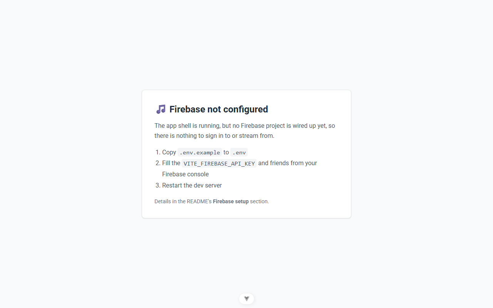

# Music App

**Live demo: <https://music-plum-chi.vercel.app>**

A Vue 3 + Vite music-streaming SPA (installable PWA): browse a paginated song playlist,
register/log in, upload your own tracks, edit or delete them on the manage page, play songs
through a persistent Howler.js player bar, and comment on songs. All data lives in Firebase
(Auth + Firestore + Storage). The Firebase config is injected via `VITE_FIREBASE_*` env vars
(see [Firebase setup](#firebase-setup)) — without them the app shows a friendly setup banner:



> **New developer? Start with [`.docs/tldr.md`](.docs/tldr.md)** — every doc summarised on one
> page. The full guide lives in [`.docs/`](.docs/README.md).

## Prerequisites

| Tool | Version | Installed by |
| --- | --- | --- |
| PowerShell + winget | Windows 10/11 stock | — (the only true prerequisites) |
| Git | any recent | `setup.ps1` (winget) |
| Node.js | LTS (verified on v24) | `setup.ps1` (winget) |
| just | any recent | `setup.ps1` |
| Claude Code CLI | latest | `setup.ps1` (optional, for AI-assisted dev) |

## Quick start

```powershell
# 1. One-time machine setup (idempotent — safe to re-run)
pwsh ./setup.ps1

# 2. Close and reopen PowerShell so PATH updates land

# 3. Install dependencies (npm ci from the lockfile; also downloads the Cypress binary)
just install

# 4. (Optional but recommended) wire up Firebase — see "Firebase setup" below
Copy-Item .env.example .env   # then fill in your VITE_FIREBASE_* values

# 5. Start the dev server
just start
```

The app is now at **http://localhost:8115**. Stop it with `just stop`.
(Use `localhost`, not `127.0.0.1` — Vite binds the IPv6 loopback `[::1]` here.)
Without a filled `.env` you get the setup banner shown above instead of the player UI.

## Firebase setup

The app needs a (free-tier) Firebase project with **Authentication (email/password)**,
**Cloud Firestore**, and **Storage** enabled:

1. Create a project at <https://console.firebase.google.com> and add a **web app** to it.
2. Copy `.env.example` to `.env` (git-ignored — never commit it).
3. Fill each `VITE_FIREBASE_*` value from **Project settings → Your apps → SDK setup and
   configuration**. `VITE_FIREBASE_MEASUREMENT_ID` is optional (Analytics).
4. Restart the dev server (`just stop`, then `just start`).

The values land in the client bundle by design — a Firebase *web* config is public — but
keep real server-side secrets out of `.env` anyway. With no `.env` (or a blank API key) the
config module (`src/includes/firebase-config.js`) falls back to an empty object and
`src/main.js` renders the "Firebase not configured" banner instead of mounting the app.

## Commands

Run `just` with no arguments to list every recipe. The ones you'll use daily:

| Command | What it does |
| --- | --- |
| `just install` | Install dependencies (`npm ci`) |
| `just start` | Dev server on :8115 in a background window |
| `just dev` | Dev server in the foreground (Ctrl+C to stop) |
| `just stop` | Stop only THIS repo's node processes |
| `just build` | Production build to `dist/` (includes the PWA service worker) |
| `just preview` | Serve the production build on :8115 |
| `just lint` | ESLint with auto-fix (`eslint . --fix`) |
| `just format` | Prettier write on `src/` |
| `just test` | Vitest single run — all 9 spec files green, no Firebase keys needed |
| `just claudex` | Launch Claude Code (Sonnet, all permissions) |

Cypress e2e exists too (`npm run test:e2e`) but is intentionally not a just recipe — it
drives `vite preview` on :4173 and needs a filled `.env` to get past the setup banner.
See [`.docs/03-development/workflow.md`](.docs/03-development/workflow.md).

## Troubleshooting

### `127.0.0.1:8115` refuses to connect but the server is running

Vite binds the IPv6 loopback (`[::1]`) on this setup — use `http://localhost:8115`, not the
IPv4 literal.

### The page shows "Firebase not configured" instead of the player

Working as intended: no `VITE_FIREBASE_*` env vars were found, so the app renders the setup
banner instead of mounting. Follow [Firebase setup](#firebase-setup) — copy `.env.example`
to `.env`, fill the values, restart the dev server. (If you instead see a *blank* page,
check the browser console — that would be a different problem.)

### `just start` window closes immediately / "Port 8115 is already in use"

The dev server runs with `--strictPort`, so it exits instead of hopping ports. Run
`just stop` to kill a lingering server from this repo, or find the squatter with
`netstat -ano | findstr :8115` and stop it.

### `just test` hangs / opens a browser UI

The npm script `test:unit` is `vitest --ui` (watch + browser — never exits); `just test`
appends `--run` for a single headless pass. Use `just test`, not `npm run test:unit`.
The whole suite (9 spec files) passes with no Firebase keys — specs stub the firebase
module (`vi.mock('@/includes/firebase')`), so a failure is your change, not the setup.

### `just` or `node` not found after running setup.ps1

PATH changes land in new shells only. Close and reopen PowerShell, then retry. If it
persists, re-run `pwsh ./setup.ps1` and read its `[FAIL]`/`[WARN]` lines.

More in [`.docs/06-troubleshooting/common-issues.md`](.docs/06-troubleshooting/common-issues.md).

## Project layout

```
music-app/
  index.html               # Vite entry page (Roboto + Font Awesome CDN links)
  .env.example             # Firebase env template — copy to .env (git-ignored) and fill
  vite.config.js           # Vue + PWA + devtools + Tailwind v4 plugins, @ -> src alias
  vitest.config.js         # jsdom test env (merges vite.config.js)
  cypress.config.js        # e2e baseUrl http://localhost:4173 (vite preview)
  eslint.config.js         # ESLint 9 flat config (vue + vitest + cypress + prettier)
  justfile, setup.ps1      # dev recipes + machine bootstrap
  src/
    main.js                # createApp gated inside firebase.onAuthStateChanged;
                           # renders the setup banner when Firebase is unconfigured
    App.vue                # AppHeader + <router-view> + AppPlayer + AppAuth modal
    router/index.js        # /, /about, /manage (auth-guarded), /song/:id, catch-all
    views/                 # HomeView, AboutView, ManageView, SongView
    components/            # AppHeader, AppAuth + Auth/, AppPlayer, Upload,
                           # SongItem, CompositionItem (+ __tests__/ with 9 specs)
    stores/                # user, player (Howler), modal, counter (unused scaffold)
    includes/              # firebase.js (SDK bundle), firebase-config.js (env-driven
                           # config), not-configured.js (setup banner), validation.js,
                           # i18n.js, helper.js, progress-bar.js, _global.js
    directives/icon.js     # v-icon Font Awesome helper
    locales/               # en.json, ms.json (vue-i18n)
  cypress/                 # e2e specs + support commands
  template/                # original static HTML mockups the views were built from
  public/assets/img/       # header/intro/song images + PWA icon
  docs/images/             # README screenshots
  dev-dist/                # PWA dev service-worker output (tracked; regenerated in dev)
  .docs/                   # developer documentation (start at tldr.md)
  .claude/                 # Claude Code skills, settings, statusline
```
